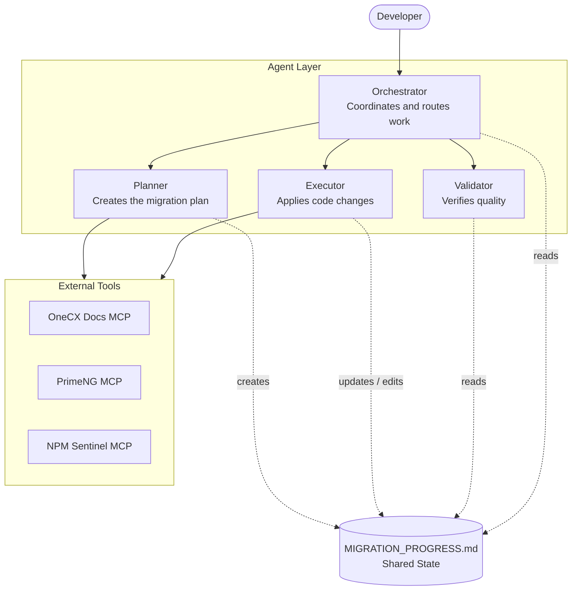
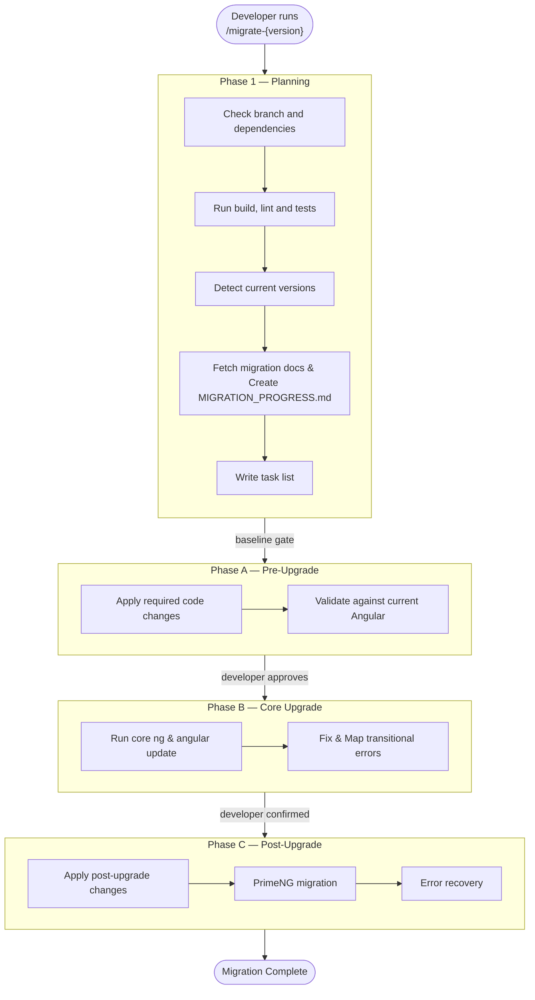

# OneCX Angular Migration Agent

AI-assisted Angular version migration for OneCX applications.

!!! IMPORTANT
    This is an expert tool given to devopers to provide extended support with the migration process. It is NOT a fully autonomous agent and requires developer oversight, especially for validation and decision-making.
    - The expected migration work done by the agent is around 75% for generated apps and 50% for non-generated apps.
    - This tool can perfom tasks such as code changes will the help of official documentation. As this agents use llm models so they are deterministic in nature.
    -  The developer is expected to fix any style or css issues that may occur after the migration is complete. Which is execpected even if the developer doen't use this tool.   


## Quick Start
#### 1. Copy to your repo
```bash
cp -r .github/* /path/to/your/repo/.github/
```
Note: Restart or Reload Vscode current window to make sure agents are loaded

#### 2. Customize (optional but recommended)
Edit these files for your project if required:
- `.github/instructions/migration-custom-user.instructions.md` — your project patterns
- `.github/instructions/migration-18-19.instructions.md` — version-specific URLs/data

#### 3. Start migration
Start migration with the following commands in copilot chat
```
/migrate-19
/migrate-20
/migrate-21
```

#### 4. Execute tasks
```
@migration-orchestrator "Continue execution"
```
or 
Select one of the handoff button provided
Repeat until Phase A is complete. Then approve Phase B upgrade, then continue through Phase C.

---

## Architecture

This workspace runs an AI-assisted Angular version migration for OneCX applications.

- **MIGRATION_PROGRESS.md** is the single source of truth for all task state
- All migration tasks are derived from official documentation — never invented
- Orchestrator chains executor spawns (one task each) with smart stop conditions
- Validation order is always: build → lint → test (every task, every phase)
- When documentation is unclear or contradictory, stop and ask the user
- Use `@migration-orchestrator` to start, continue, skip, or check status
  


#### Key Features: 
1. **Orchestrator Pattern**: Single user-facing agent coordinates all work
2. **Subagent Execution**: Specialized agents handle planning, execution, and validation
3. **Automatic Rule Injection**: Core rules apply to all agents without redundant setup
4. **Evidence-Driven**: All decisions backed by official documentation and task logs


#### Repository structure:
```
.github/
├── agents/
│   ├── migration-orchestrator.agent.md                — coordinator (user-facing)
│   ├── migration-planner.agent.md                     — discovery & planning (subagent)
│   ├── migration-executor.agent.md                    — task execution (subagent)
│   └── migration-validator.agent.md                   — independent verification (subagent)
├── instructions/
│   ├── migration-rules.instructions.md                — core rules (auto-injected into ALL agents)
│   ├── migration-progress-format.instructions.md      — evidence format (auto-injected on progress file)
│   ├── migration-custom-user.instructions.md          — YOUR project rules (can add custom instruction)
│   └── migration-18-19.instructions.md                — version-specific data & instruction
│   └── migration-19-20.instructions.md                — version-specific data & instruction
│   └── migration-20-21.instructions.md                — version-specific data & instruction
├── prompts/
│   └── migrate-19.prompt.md                           — /migrate-19 quick-start command
│   └── migrate-20.prompt.md                           — /migrate-20 quick-start command
│   └── migrate-21.prompt.md                           — /migrate-21 quick-start command
└── templates/
    ├── MIGRATION_PROGRESS.template.md                 — progress file template
    └── tasks.json                                     — VS Code tasks for build/lint/test
```

---

## How It Works

#### Agent Roles

| Agent | Role | Visible to User? | Tools |
|-------|------|-------------------|-------|
| **Orchestrator** | Route commands, manage state, enforce phase gates | Yes | read, search, edit, agent, web |
| **Planner** | Discover docs, create MIGRATION_PROGRESS.md (runs ONCE) | No (subagent) | read, search, web, execute |
| **Executor** | Execute ONE task per invocation with full evidence | No (subagent) | read, search, edit, execute, web |
| **Validator** | Verify task completeness, run build/lint/test checks | No (subagent) | read, search, execute |

#### Workflow

```
User: /migrate-19, /migrate-20, /migrate-21
  │
  ├─ Orchestrator checks branch, routes to Planner
  │   └─ Planner: audits, discovers docs, creates task tree
  │
  ├─ User: "Continue execution"
  │   └─ Orchestrator routes to Executor (ONE task)
  │       └─ Executor: fetch docs → check repo → execute → validate → update progress
  │
  ├─ User: "Validate"
  │   └─ Orchestrator routes to Validator (independent check)
  │
  ├─ User: "Skip~3"
  │   └─ Orchestrator: marks 3 tasks [-], jumps to next
  │
  └─ Phase gates enforced by Orchestrator at A→B and B→C transitions
```

#### Handoffs
After each action, the Orchestrator shows clickable buttons:
- **Continue Execution** — execute next task
- **Skip Tasks** — mark tasks not applicable
- **Show Status** — current progress summary
- **Validate** — independent verification

| Command | What It Does |
|---------|--------------|
| `"Continue execution"` | Execute next task (Phase A, B, or C) |
| `"Skip~N"` | Mark next N tasks not applicable, jump to N+1 |
| `"Status"` | Show current progress from MIGRATION_PROGRESS.md |
| `"Validate"` | Run independent verification (task or phase gate) |
| `"Help"` | Show available commands |

---

#### Phases

| Phase | What Happens | Validation |
|-------|-------------|------------|
| **Phase 1** | Audit repo, discover docs, create task tree | Baseline npm install/build/lint/test must all pass |
| **Phase A** | Pre-upgrade code changes (imports, templates, configs) | npm build/lint/test after each task |
| **Phase B** | Core package upgrades (Angular, Nx, PrimeNG) | Requires explicit developer approval gate |
| **Phase C** | Post-upgrade cleanup and fixes | npm build/lint/test after each task |



---